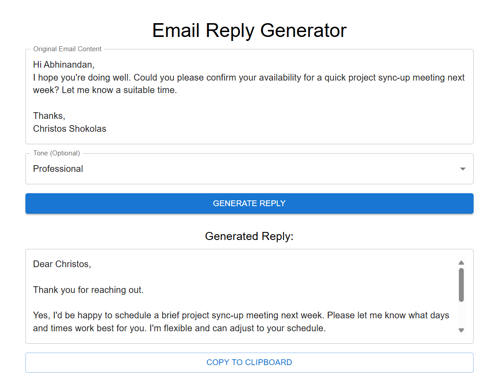

# Smart Email Assistant

A productivity tool that helps users compose intelligent and context-aware email replies directly within **Gmail** using AI.

This project consists of:
- A **Spring Boot backend** that integrates with the **Google Gemini API** to generate smart email responses.
- A **Chrome Extension frontend** that adds an **"AI Reply"** button in the Gmail reply window to automate and streamline the email reply process.
- A **React-based Web UI** that allows users to input or paste email content and receive AI-generated replies directly through a web interface.

---

## 🚀 Features

- 📩 **AI-Generated Email Replies:** Automatically generate context-aware replies using Google's Gemini AI.
- 🖱️ **Seamless Gmail Integration:** Chrome Extension adds an **AI Reply** button next to Gmail’s native **Send** button.
- 🌐 **Web Interface (React UI):** Users can generate replies via a separate web-based UI for flexibility outside Gmail.
- 🎯 **Customizable Reply Tone:** Supports generating replies in different tones such as formal, casual, or friendly based on user selection.
- 🔄 **Auto Content Capture:** Captures the content of the email thread to generate an appropriate response.
- ⏱️ **Reduces Response Time:** Speeds up the email replying process by over **50%** for common queries.
- 🔐 **Non-intrusive:** Integrates with Gmail without affecting its core functionalities.

---

## 🛠️ Tech Stack

| Layer      | Technologies |
|------------|--------------|
| **Backend**  | Java, Spring Boot, Google Gemini API |
| **Frontend (Chrome Extension)** | JavaScript, HTML, CSS |
| **Web UI**  | React, JavaScript |

---

## 📦 Project Structure

```
smart-email-assistant/
│
├── email-writer-backend/       # Spring Boot backend - API to call Google Gemini API
├── email-writer-ext/           # Chrome Extension - injected into Gmail interface
├── email-writer-frontend/      # React-based Web UI for generating replies
├── assets/                     # Screenshots and assets for documentation
├── .gitignore
├── README.md
```

---

## 🔧 Setup Instructions

### Backend (Spring Boot)
1. Navigate to the **email-writer-backend/** directory.
2. Configure your **Google Gemini API key** in `application.properties`.
3. Run the Spring Boot application:
```bash
./mvnw spring-boot:run
```

### Chrome Extension
1. Navigate to the **email-writer-ext/** directory.
2. Load the Chrome Extension manually:
   - Open **chrome://extensions/**
   - Enable **Developer Mode**
   - Click **Load Unpacked** and select the `email-writer-ext/` directory.
3. The **AI Reply** button will appear next to the **Send** button in Gmail's reply window.

### React Web UI
1. Navigate to the **email-writer-frontend/** directory.
2. Install dependencies:
```bash
npm install
```
3. Start the React app:
```bash
npm run dev
```
4. Access the UI at **http://localhost:5173/** to input email content and generate AI replies.

---

## 📸 Screenshots

### AI Reply Button in Gmail


### Example of AI-Generated Reply


### React Web UI


---

## 🔮 Future Enhancements
- Support for additional email platforms.

---
